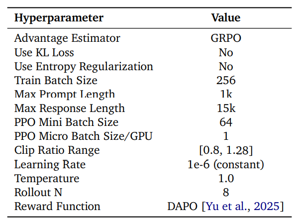

## readerlm-V2
目标：使用小llm处理专用任务 提取网页内容 (html2json或markdown)

训练数据生成
Draft Refine Critique三段式生成数据
先用提示词生成一个初稿，再让llm修改，再判断

训练
持续预训练：涉及到长度外推
sft：使用两个数据集训练两个checkpoint 缓解数据分布冲突来提升模型性能？
线性参数合并（linear parameter merging）对任务特定的检查点进行加权插值
dpo
自迭代：利用上一步训练好的模型再来一遍

评价指标
衡量两段文字的相似程度
Levenshtein 距离 Damerau-Levenshtein 距离 ROUGE-L Jaro-Winkler 相似度

Merge Models
为不同语言 任务合并模型？
很难为多任务训练制定数据集混合策略 
为特定任务分别训练独立模型，随后通过预定义算法进行权重合并 ADAMERGING论文
多任务学习的两种方式：联合训练和模型合并

模型合并方法追根溯源到 EDITING MODELS WITH TASK ARITHMETIC论文
$θ_new=θ+λτ$
对预训练模型添加单个任务向量且 λ=1 时，相当于对该任务进行了微调。

## text2json 
通过种子数据进行数据扩充：先通过模板扩充output，再通过llm为每个output生成input
收获：可以构建好output反向通过llm生成input进行数据扩充

## orca
构建数据集：从已有的数据集利用gpt4 采样 重构
先用chatgpt生成5m回答，训练一版模型 再用gpt4生成1m回答，训练第二版
原因：渐进式学习 学生模型先从较简单的示例中学习，再逐步过渡到更复杂的任务。并且降低成本

大规模结果分析
利用gpt4作为裁判，判别哪个好
100samples具体分析
启发：在微调模型之前要明确需要模型做到哪些事情，比如对于给定输入 要怎么输出 然后以此为目标构建数据集

## Gorilla: Large Language Model Connected with Massive APIs
致力于让模型更好地生成api call
数据搜集：从huggingface 的model card
{domain, framework, functionality,
api_name, api_call, api_arguments, environment_requirements, example_code, performance, and
description.}
共1645个api
再用gpt4为每个api生成10个指示 类比真实的使用场景

训练
这种需要参考特定文档的任务，容易联想到rag

## react
通过提示词引导模型 观察-思考-行动 不断循环
格式：
input xxx
thought 1 我应该xxx
action 1 api call
Observation 1 call的结果
thought 2 基于xx结果，我下一步应该xxx
action 2 
...
action n finish

## autodsl

AutoDSL 通过分析大量实验语料，自动设计出一个“懂领域”的 DSL；然后用这个 DSL 作为“规则手册”，指导 LLM 将新协议翻译成结构清晰、可验证、可执行的程序。

输入为n份自然语言实验报告或专业知识描述
输出为 syntactic constraints 句法约束规则 循环，分支，条件
和 semantic constraints 语义约束规则 具体操作，比如 add remove

llm在构建dsl时 实体提取，辅助分析
使用：dsl规则作为提示词，llm把自然语言转化成规范化可执行的dsl语句

## PAL: Program-aided Language Models
利用LLM阅读自然语言问题并生成程序作为推理步骤，而将求解步骤交由Python解释器执行
规避了计算错误，也提供了更强大的工具

## QwenLong-L1.5
目标：解决长上下文推理 基于Qwen3-30B-A3B-Thinking
1 数据 长上下文数据合成流水线
2 RL  面向长上下文训练的稳定强化学习 DAPO 移除 KL 正则化
3 记忆 面向超长上下文的记忆增强架构

针对长文档的问答对生成方式：
使用知识图谱，表格，多agent系统辅助
多agent系统 参考 SPELL: SELF-PLAY REINFORCEMENT LEARNING FOR
EVOLVING LONG-CONTEXT LANGUAGE MODELS

训练流水线：
多阶段长度扩展 包括模型融合方法？

任务均衡采样
负梯度裁剪
动机：错误回答中往往包含大量正确的中间步骤，这进一步加剧了强化学习中的奖励信用分配问题
做法：对负样本中的高熵响应或高熵 token 进行梯度裁剪
结果：避免对“虽错误但包含合理探索”的高熵部分施加过强惩罚，从而在保持训练稳定性的同时，保留模型的推理探索能力。

评测：llm as a judge 提示词

## SPELL

agent系统中三个角色
提问者生成问题和参考答案a，解答者回答问题，生成答案y，验证者验证a和y之间的语义相似性
进阶：提问者通过问题池由简向难提问题 见qwen long1.5

## justRL
小模型 先蒸馏 再RL提升能力
先总结了RL技巧：
EC = 熵控制（Entropy Control）
THP = 超参数调优（Tune Hyperparameters）
TTP = 训练提示调优（Tune Training Prompt）
RKL = 重置KL参考模型（Reset KL Reference）
LC = 长度控制（Length Control）
AT = 自适应温度（Adaptive Temperature）
RR = Rollout Rescue（回溯救援）
DS = 动态采样（Dynamic Sampling）
ST = 分阶段训练（Split Training Stages）

后续把这些概念搞懂一些吧
dapo 和 gspo 的基本原理

参数：

## DeepScaleR
数据集构建
内容构成：数学题
步骤
1. 使用llm从文档中提取标准答案
2. RAG去除冗余
3. 移除不能通过spacy直接判断对错的题目

奖励函数
只有0和1 1的条件是格式和正确性都通过

训练过程
两阶段grpo 长度从8k拓展到24k
细节：8k训练时1000step时长度突然变长，此时保存一个检查点，切换成16k训练

启示：
`DeepSeek-R1` 的研究表明，直接对小型模型应用 RL 的效果不如蒸馏（distillation）。其消融实验显示：在 Qwen-32B 上直接进行 RL 训练在 AIME 上仅达到 47% 的准确率，而仅通过蒸馏即可达到 72.6%。一种常见的误解是“RL 扩展只对大模型有效”。然而，如果小型模型能先从更大模型蒸馏出高质量的监督微调（SFT），那么它同样可以通过 RL 显著提升推理能力。
小模型要先sft后再RL

## POLARIS

数据集：
构建难度梯度，倒j形 大部分是中等偏难的样本
移除不微调就能8/8(8次采样全部答对)的样本 

训练过程中每次一个阶段之后也动态剔除难度简单的样本
温度动态调整

推理时使用yarn技术进行长度外推 对生成长思维链的样本表现更好

避免探索时一个批次内全队或全错

改进的grpo：移除Entropy Loss和KL，提高clip上限

## STILL-2
LLM推理中的行为：规划（planning）、分而治之（divide-and-conquer）、自我修正（self-refinement）、总结（summarization）以及回溯（backtracking）

模仿-探索-自改进三步骤

数据集：通过LLM合成 尽可能难度偏高 通过提示词引导模型生成思考过程 生成后通过规则筛选和正确性验证

SFT：少部分样本对qwen2.5 Instruct 进行微调 目的是让模型学会思考格式 

探索：多段迭代，利用训练好的模型扩充数据集，再进行下一轮训练 每一轮都以base模型/接着上一轮 为起点

dpo：对齐粒度 可以对全部回答或只对思考过程进行对齐

搜集样本时关注困惑度指标

结论：数学题能提升模型思考水平，且该能力能迁移到其他领域。所以可以通过加数学题或普通代码体提升模型水平

## LOONGFLOW
除了RL训练外另一种角度：编排llm agent
FunSearch [1] 利用 LLM 发现新颖的数学构造，Eureka [2] 通过进化搜索优化奖励函数，AlphaEvolve [3] 则实现了启发式算法的自动化发现
OpenEvolve 

## SHADOW-FT
先对BASE模型进行微调，然后将所学到的权重更新直接“嫁接”到INSTRUCT模型上
和任务向量的思想类似 嫁接就是简单加法

## 1.4 Million Open-Source Distilled Reasoning Dataset to Empower Large Language Model Training
大规模数据集构建
数据搜集：分类，标注难度，去重
响应生成：对于已有答案的，输入模型获得思维链；设定标准并利用llm打分，拒绝采样（生成多个候选响应 → 用多种标准打分/验证 → 拒绝低质量样本，仅保留高质量样本用于训练。）

## Tongyi DeepResearch

## AceReason-Nemotron 1.1
结论：
1 增加唯一提示数量对SFT模型性能的提升作用大于增加每提示响应数量。
然而，在实践中，当唯一提示数量达到一定规模后，继续扩展会因高质量、多样化数据源的稀缺而变得愈发困难。此时，为现有提示生成更多样化的响应便成为一种切实可行的替代方案，可有效进一步提升SFT模型性能。
2 将训练温度设置为使温度校正后的熵维持在约0.3左右，通常能实现高效的RL训练

## ConCodeEval
dsl和llm相结合的任务
1. 给定任务和约束，llm输出合规的格式和内容，需要满足结构和语义上的约束
2. 给定dsl和约束，判断dsl语句是否符合约束

## Does Prompt Formatting Have Any Impact on LLM Performance?
提示词格式影响任务性能
结论是不好说 “不存在一种通用最优的提示格式能够适用于所有 GPT 模型——即便是同一家族内的模型。要实现最佳性能，必须进行面向特定模型的提示工程。”

## Prompt Repetition Improves Non-Reasoning LLMs
在不使用推理（reasoning）的情况下，重复输入提示（prompt）可提升主流大语言模型（如 Gemini、GPT、Claude 和 Deepseek）的性能，且不会增加生成 token 的数量或延迟。

# agentic rl

## ToolRL: Reward is All Tool Learning Needs
工具集成推理
外部工具：计算器/代码解释器/网页搜索

奖励设计：
详细的过程奖励 没有结果奖励 只训练模型调用工具的能力 计算函数名称 参数名称 参数内容(需要ground truth)

实验
code/sft400/sft4000 start 
ppo/grpo
指标：每个批次平均格式奖励和准确性奖励

奖励中加入长度奖励 固定/动态 普遍没有提升
细粒度/动态变化的奖励更好

整个训练过程实际上不涉及外部真正运行代码
疑问：如果多轮对话且每一轮都需要使用外部工具验证的话要怎么做？

## TORL: Scaling Tool-Integrated RL
关键点：
代码使用的演变：随着训练的推进，模型使用代码解决的问题比例稳步增加，同时语法正确且可执行的代码比例也在上升。这表明模型自主获得了有效的工具利用策略。
对无效代码的自我调节：在没有明确指令的情况下，模型学会了识别并减少无效代码模式的生成，这表明其涌现出了一种关于工具有效性的元认知形式。
工具调用频率的权衡：增加每个问题允许的最大工具调用次数能显著提升性能，但也带来了严重的计算开销，揭示了工具集成学习中效率与效果之间的关键权衡。

数据集：数学题+LIMR提取具有均衡难度分布的高质量样本
疑问LIMR是啥？

TIR过程，很明了 这个是有和外界环境(代码解释其)交互的过程
quen和bytedance各有一个代码解析器

奖励：结果正确性奖励，代码是否能执行奖励，没了

结果分析
1 随着训练步数的增加，模型使用代码解决问题的比例以及可正确执行的代码比例持续增长。同时，在训练过程中，模型能够识别并减少无效代码的生成。
2 增加c(可以调用工具的次数)可以显著提升模型性能，但也会严重降低训练效率。纳入代码可执行性奖励并不能改善性能。

## 框架
### Agent-Lightning
### AgentJet
